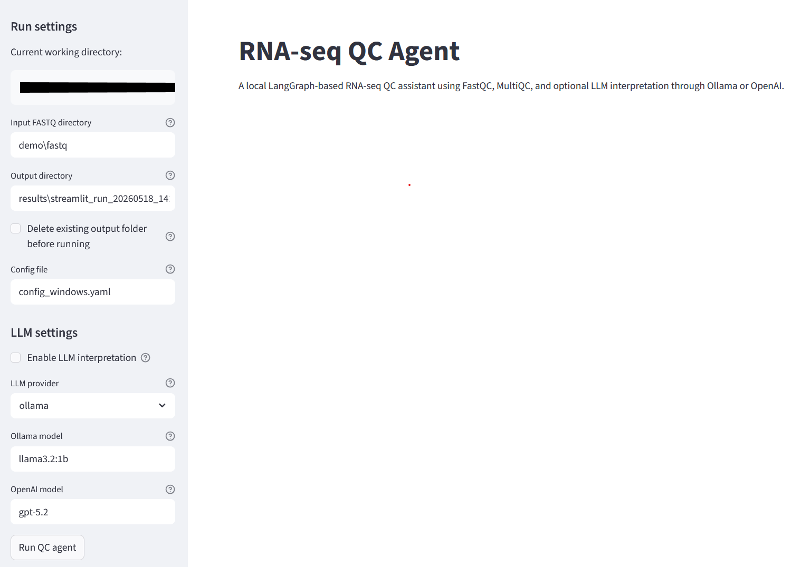
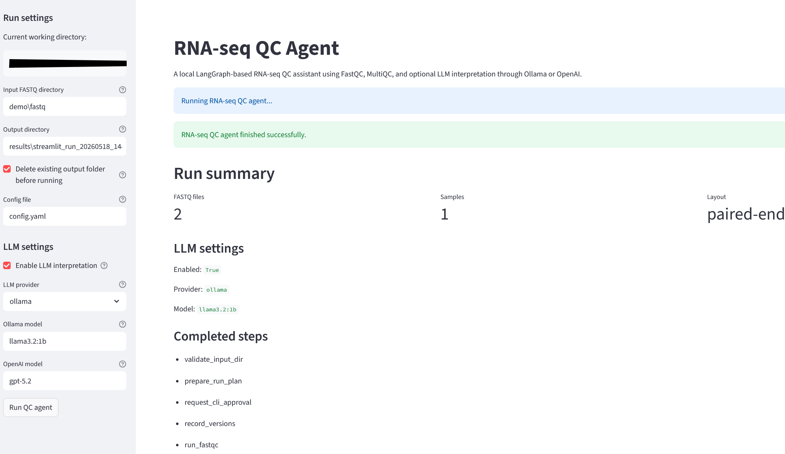
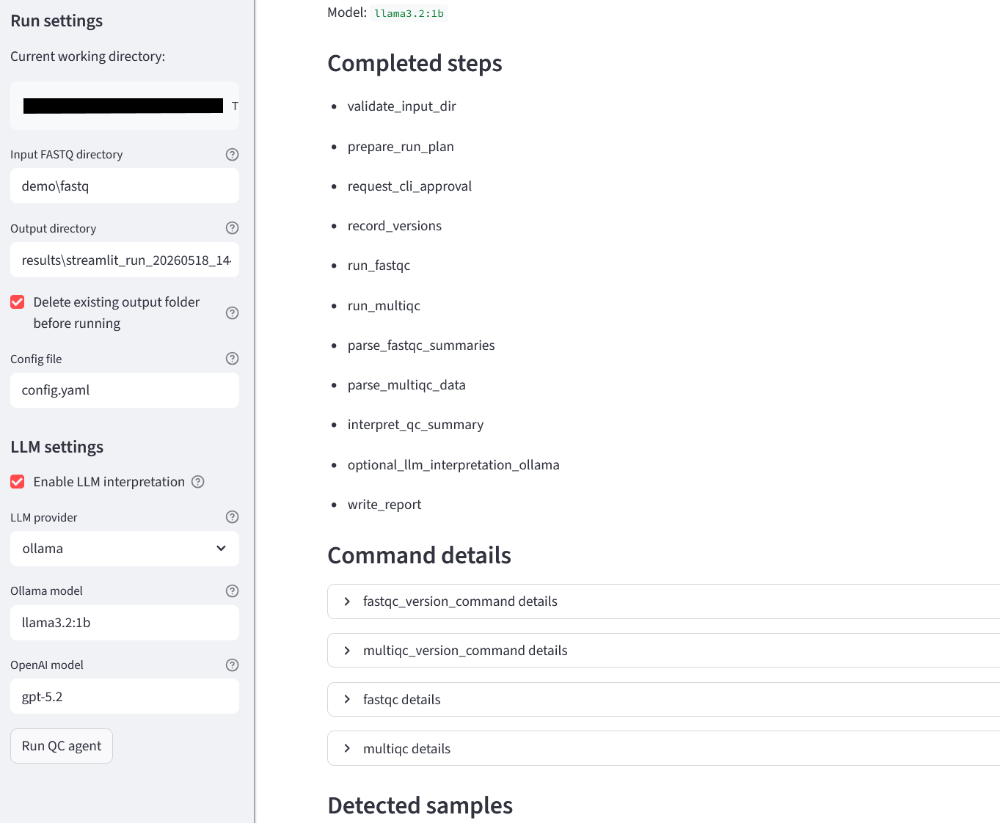
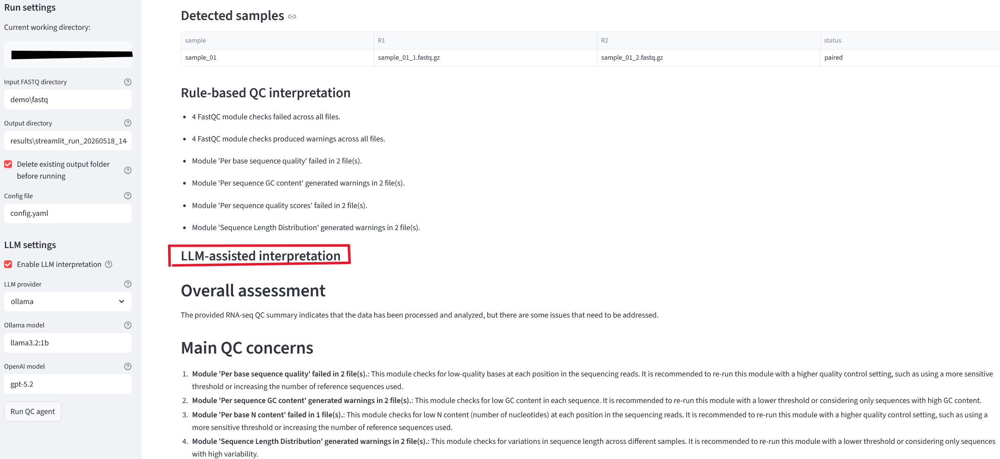
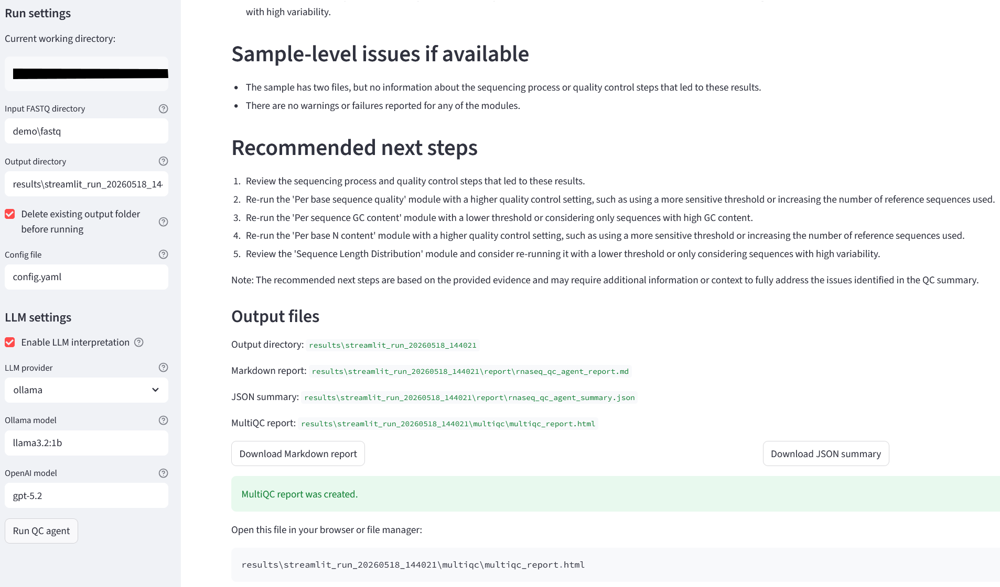

# RNA-seq QC Agent Tutorial

A local, tool-based RNA-seq quality control assistant built with **FastQC**, **MultiQC**, **Streamlit**, **LangGraph**, and an optional LLM layer using either **OpenAI** or **Ollama**.

This tutorial explains how to install, run, and use the RNA-seq QC Agent on your own RNA-seq FASTQ files.

---

## 1. What this tool does

The RNA-seq QC Agent helps users run a basic RNA-seq quality control workflow locally. It is designed for researchers who want a simple interface for checking RNA-seq data quality before downstream analysis.

The current workflow can:

1. Accept a folder containing FASTQ or FASTQ.GZ files.
2. Run **FastQC** on each sample.
3. Run **MultiQC** to summarise the FastQC reports.
4. Save all results in a user-defined output folder.
5. Optionally use an LLM to provide a plain-language interpretation of the QC results.
6. Provide a Streamlit web interface for users who prefer not to run everything from the command line.

---

## 2. Who is this tutorial for?

This tutorial is intended for users who:

- Have RNA-seq FASTQ files.
- Want to run initial quality control locally.
- Prefer a graphical interface but are comfortable using a terminal for installation.
- Want the option to use either a local LLM through Ollama or an OpenAI model for interpretation.

The tutorial is written for Windows users using **Anaconda Prompt**, but the same general steps also apply to Linux and macOS.

---


## 3. Prerequisites

Before starting, install the following:

### Required software

- Anaconda or Miniconda
- Python 3.10 or 3.11
- Java, required by FastQC
- FastQC
- MultiQC

### Optional software

- Ollama, for running a local LLM
- OpenAI API key, for using OpenAI models
- VS Code, for editing and inspecting the code

---

## 4. Clone the GitHub repository

Open **Anaconda Prompt** and move to the folder where you want to keep the project.

```bash
cd C:\Users\YourName\Documents\projects
```

Clone the repository:

```bash
git clone git@github.com:ZhangOmicsDataLab/rnaseq-qc-agent.git
```

Move into the project folder:

```bash
cd rnaseq-qc-agent
```

If you are using HTTPS instead of SSH, use:

```bash
git clone https://github.com/ZhangOmicsDataLab/rnaseq-qc-agent.git
```

---

## 5. Create the conda environment

Create a new conda environment:

```bash
conda create -n rnaseq-agent python=3.11 -y
```

Activate it:

```bash
conda activate rnaseq-agent
```

Install the Python dependencies:

```bash
pip install -r requirements.txt
```

Or, if the project includes an `environment.yml` file:

```bash
conda env create -f environment.yml
conda activate rnaseq-agent
```

Check that Python is working:

```bash
python --version
```
---

## 6. Install and test FastQC

FastQC is required to generate quality control reports for FASTQ files.

### On Linux or macOS

FastQC can usually be installed with conda:

```bash
conda install -c bioconda fastqc -y
```

Test it:

```bash
fastqc --version
```

### On Windows

If FastQC is not available through conda, download it manually from the Babraham Bioinformatics website.

After extracting FastQC, yetou can test FastQC using:

```bash
C:\extraction Folder\FastQC\run_fastqc.bat --version
```

If the command works, update the FastQC path in the Streamlit app or configuration file if required.

---

## 7. Install and test MultiQC

Install MultiQC in the active conda environment:

```bash
pip install multiqc
```

Test it:

```bash
multiqc --version
```

MultiQC should print the installed version.

---

## 8. Optional: install Ollama for local LLM interpretation

The RNA-seq QC Agent can optionally use a local LLM through Ollama. This allows the tool to interpret the MultiQC results without sending data to an external API.

Install Ollama from the official website, then open Anaconda Prompt and test:

```bash
ollama --version
```

Pull a small model, for example:

```bash
ollama pull llama3.2:1b
```

Test the model:

```bash
ollama run llama3.2:1b
```

You can type a simple question such as:

```text
Explain what FastQC does in one sentence.
```

---

## 9. Optional: configure an OpenAI API key

To be tested


---

## 10. Run the Streamlit app

Make sure the conda environment has been activated.

From the project root folder, run:

```bash
streamlit run app/streamlit_app.py
```

Streamlit will start a local web server and show a URL similar to:

```text
Local URL: http://localhost:8501
```

Open this address in your web browser.

---

## 11. Using the web interface

The Streamlit interface allows you to select input and output folders and choose whether to use LLM interpretation.

Typical inputs are:

- **Input FASTQ folder:** folder containing `.fastq`, `.fq`, `.fastq.gz`, or `.fq.gz` files.
- **Output folder:** folder where FastQC and MultiQC results will be saved.
- **LLM option:** no LLM, Ollama, or OpenAI.
- **Run button:** starts the QC workflow.




---

## 12. Example analysis using demo data

The repository includes a small demo folder:

```text
demo/fastq/
```

To run the demo:

1. Start the Streamlit app.
2. Set the input folder to:

```text
demo/fastq
```

3. Set the output folder to a new folder, for example:

```text
results/demo_run_01
```

4. Choose whether to enable LLM interpretation.
5. Click **Run QC analysis**.

Important: use a new output folder for each run. If the output folder already exists, the app should warn you before continuing. This avoids accidentally mixing old and new results.

---

## 13. Expected outputs

After a successful run, the output folder should contain files similar to:

```text
results/demo_run_01/
├── fastqc/
│   ├── sample_1_fastqc.html
│   ├── sample_1_fastqc.zip
│   ├── sample_2_fastqc.html
│   └── sample_2_fastqc.zip
├── multiqc/
│   ├── multiqc_report.html
│   └── multiqc_data/
└── command_results.json
```

The most important file is:

```text
multiqc/multiqc_report.html
```

Open this file in a browser to inspect the full MultiQC report.






---

## 14. Reading the MultiQC report

The MultiQC report summarises the quality of all samples in one HTML file.

Common sections include:

- General statistics
- Per base sequence quality
- Per sequence quality scores
- Per base sequence content
- GC content
- Sequence duplication levels
- Overrepresented sequences
- Adapter content

---

## 15. Using LLM interpretation

If LLM interpretation is enabled, the agent will attempt to summarise the QC results in plain language.

The LLM output may include:

- Overall QC status
- Samples that may need attention
- Possible adapter contamination
- Possible low-quality bases
- Suggestions for trimming or filtering
- Warnings about limitations

Example interpretation:

```text
The samples passed most basic QC checks. However, Sample_2 shows increased adapter content and lower per-base quality toward the 3' end. Consider adapter trimming and re-running FastQC/MultiQC before downstream analysis.
```

The LLM output should be treated as an assistant-generated interpretation, not as a replacement for manually checking the MultiQC report.


---

## 16. recommended workflow for real data

For real RNA-seq datasets, a good workflow is:

1. Create a separate input folder for each project.
2. Keep raw FASTQ files unchanged.
3. Create a new output folder for every QC run.
4. Run the QC agent.
5. Open the MultiQC report manually.
6. Use the LLM interpretation as an additional explanation layer.
7. Decide whether trimming or filtering is needed.
8. Re-run QC after trimming if required.

Example folder layout:

```text
project_A/
├── raw_fastq/
├── qc_results/
│   ├── qc_run_01_raw_reads/
│   └── qc_run_02_trimmed_reads/
└── trimmed_fastq/
```

---

## 17. Future development

Planned extensions include:

- Better error handling for Windows paths.
- Clearer Streamlit warnings when output folders already exist.
- Optional read trimming.
- Automated summary tables from MultiQC data files.
- Improved LLM prompts for QC interpretation.
- Support for more complete RNA-seq analysis workflows.
- Deployment on local servers or HPC systems.
